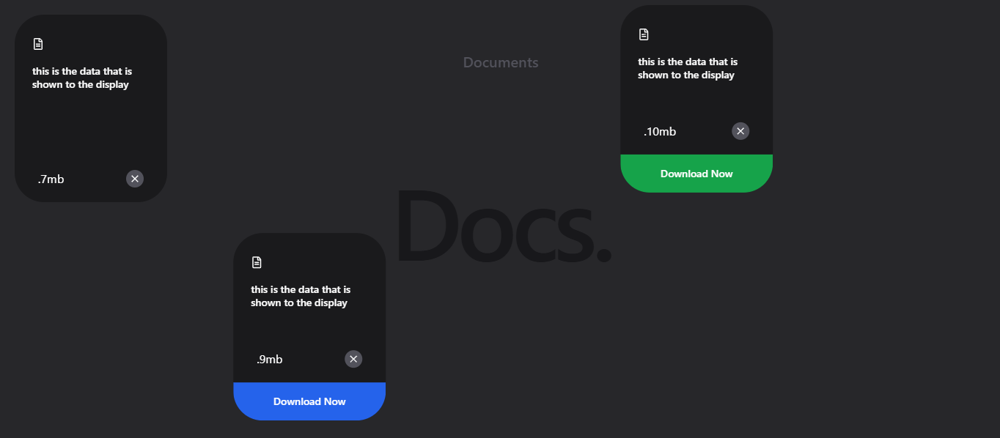

<h1 align="center">📚 Docs Mini Project</h1>

  
   

<h2>🚀 Project Overview</h2>

  <strong>Docs Mini Project</strong> is a simple React-based documentation site built with <strong>Vite</strong>. 
  It uses <strong>TailwindCSS</strong> for styling, <strong>Framer Motion</strong> for smooth animations, 
  and <strong>React Icons</strong> for visuals. The project includes <strong>ESLint</strong> configuration for 
  consistent code quality.

---

<h2>⚙️ Installation and Setup</h2>
<ol>
  <li>Install dependencies:</li>
  <pre><code>npm install</code></pre>

  <li>Start the development server:</li>
  <pre><code>npm run dev</code></pre>

  <li>Open your browser and navigate to:</li>
  <pre><code>http://localhost:5173</code></pre>
</ol>

---

<h2>🛠️ Tech Stack</h2>
<ul>
  <li><strong>Frontend:</strong> React, Vite</li>
  <li><strong>Styling:</strong> TailwindCSS</li>
  <li><strong>Animation:</strong> Framer Motion</li>
  <li><strong>Icons:</strong> React Icons</li>
  <li><strong>Linting:</strong> ESLint</li>
</ul>
